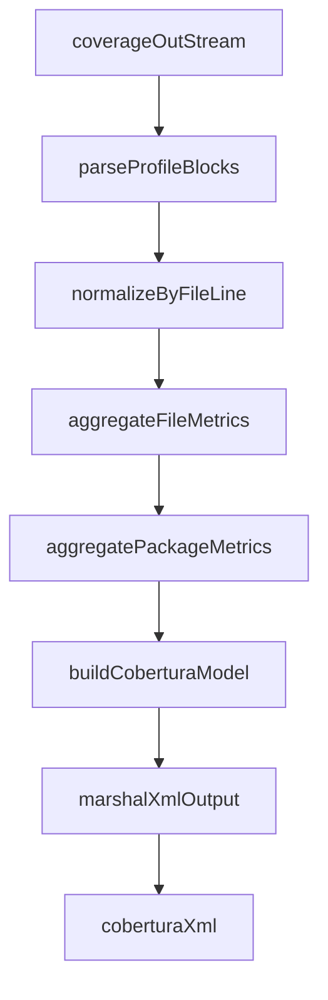

# go-cobertura

Native Go coverage (`coverage.out`) to Cobertura XML converter.

`go-cobertura` is a modern, zero-legacy-dependency CLI that converts Go coverage profiles directly into Cobertura-compatible XML for CI systems such as GitLab, Azure DevOps, and Jenkins.

## Requirements

- Go `1.25.0` or newer.

## Goals

- Parse Go coverage profiles (`Go 1.25.0+`) without intermediate JSON or subprocess pipelines.
- Produce deterministic Cobertura XML suitable for automated CI ingestion.
- Keep implementation lightweight and fast (stdlib-first design).
- Provide a simple, script-friendly CLI.

## Non-Goals

- No dependency on legacy converters (`gocov`, `gocov-xml`, `gocover-cobertura`).
- No runtime shell-out to external coverage conversion tools.
- No non-Cobertura report format support in the initial release.
- No cyclomatic complexity enrichment in the initial release.

## Dependency Policy

- Hard requirement: conversion is fully native and in-process.
- Allowed dependencies: Go standard library, and optionally `golang.org/x/tools` only if strictly necessary.
- Disallowed dependencies (build or runtime): `gocov`, `gocov-xml`, `gocover-cobertura`.

## Cobertura Metrics Contract

Generated XML must include and validate the following metrics:

- `line-hits`: executed lines (per line and aggregated).
- `line-count`: executable lines (per class and aggregated).
- `line-rate`: `line-hits / line-count` (with zero-denominator guard).
- `branch-rate`: emitted at class/package/coverage levels with documented default policy until native branch data is supported.

## High-Level Data Flow



## Repository Layout

```text
.
├── internal/
│   ├── parser/
│   ├── cobertura/
│   └── convert/
├── testdata/
├── main.go
├── converter.go
├── go.mod
└── README.md
```

## CLI Usage

```bash
go test -coverprofile=coverage.out ./...
go-cobertura -in=coverage.out -out=coverage.xml
```

Install:

```bash
go install github.com/murli-n/go-cobertura@latest
```

Flags:

- `-in` input profile path (default: stdin)
- `-out` output XML path (default: stdout)
- `-path-strip-prefix` rewrite paths for CI portability
- `-source-root` override `<sources><source>` in Cobertura XML (default: current working directory)
- `-branch-rate-default` set default branch-rate when branch data is unavailable
- `-debug` enable debug logs on stderr

Quick run without install:

```bash
go run . -in=coverage.out -out=coverage.xml
```

## Development Phases

1. **Foundation & Parsing**
   - Implement profile parser for `set`, `count`, `atomic`.
   - Validate malformed input with actionable errors.
2. **Conversion Engine & XML**
   - Normalize blocks to lines, compute required metrics.
   - Emit Cobertura schema-compatible XML.
3. **CLI**
   - Add stdin/stdout default flow and file/path flags.
4. **Quality & Performance**
   - Golden tests, edge-case tests, CI compatibility checks.
   - Benchmark large reports (`>10k` blocks) with target `<500ms`.

## Testing Strategy

- Golden test fixtures: `testdata/*.out` -> expected `testdata/*.xml`.
- Table-driven parser and line-merge tests.
- Metric-focused assertions for `branch-rate`, `line-rate`, `line-count`, `line-hits`.
- Integration smoke checks for CI consumers (GitLab/Azure/Jenkins).

## Prior Art

This project intentionally avoids depending on older converters while learning from ecosystem conventions:

- [t-yuki/gocover-cobertura](https://github.com/t-yuki/gocover-cobertura)

## Status

Core parser, converter engine, Cobertura XML writer, CLI, tests, and benchmark are implemented.